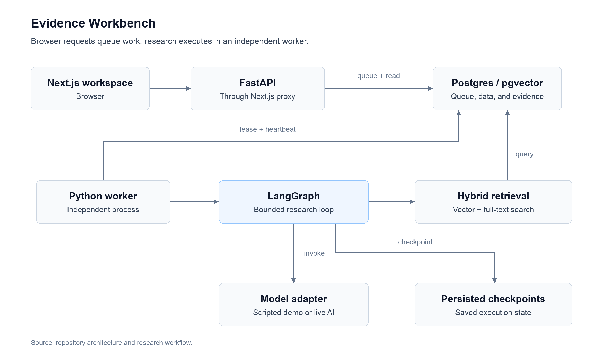

# Evidence Workbench

**Ask a research question. Approve the plan. Inspect the evidence behind the answer.**

A research workspace that turns a document collection into a cited report through a bounded, inspectable investigation. Built with Next.js, FastAPI, LangGraph, and PostgreSQL/pgvector.

[Run locally](#running-the-application) · [Reviewer walkthrough](#five-minute-reviewer-walkthrough) · [Features](#features-to-explore)

## TL;DR

- **Run locally with Docker Compose:** one startup command; no API keys, cloud account, or host Python/Node installation required.
- **Review the investigation:** edit its plan, follow saved activity, and inspect the passages supplied to each model call.
- **Trace the answer:** numbered citations open exact passages from immutable document versions; export the report as Markdown.
- **Explore the engineering:** hybrid search, durable workers, approval checkpoints, shared budgets, cancellation, and three research strategies.
- **Know what the demo proves:** responses and topic vectors are scripted fixtures; database search and workflow execution are real. Live AI and public-web adapters are implemented separately and require opt-in configuration.

## Running the application

### Prerequisites

- **Docker installed and running:** Docker Desktop on macOS/Windows, or Docker Engine with Compose v2 on Linux. Installing Docker alone is not enough; its engine must be running before startup.
- **A Bash terminal:** use your terminal on macOS/Linux. On Windows, use WSL2 with Docker Desktop integration enabled.
- **The repository:** clone it with Git, or download and extract its ZIP. Git is optional if you use the ZIP.
- **Internet access for the initial build**, available ports **3000**, **8000**, and **55432**, and disk space for Docker images, dependencies, and local data. Exact minimum RAM and disk requirements have not been benchmarked.

**No host Python, Node.js, database installation, API keys, or cloud account is required.** The default local demo uses synthetic documents and scripted responses, with no paid AI calls. Live AI is optional; see [Live mode and scope](#live-mode-and-scope).

### Start

Clone the repository, then enter its root—the directory containing [compose.yaml](./compose.yaml):

```bash
git clone https://github.com/no-complect/evidence-workbench.git
cd evidence-workbench
```

If you downloaded the ZIP instead, open a terminal in the extracted directory. Start the application with:

```bash
bash scripts/dev.sh --no-follow
```

The first build may take several minutes. The startup command automatically:

1. Creates a local `.env` from the included example if one does not already exist.
2. Builds the containers and installs the locked application dependencies inside them.
3. Starts PostgreSQL, applies database migrations, and loads the synthetic example documents.
4. Starts the API, the background research worker, and the website, then waits for service readiness.

When startup succeeds, open **[http://localhost:3000](http://localhost:3000)**. No configuration edits or sign-in are needed for a fresh local demo. Continue with the [reviewer walkthrough](#five-minute-reviewer-walkthrough) below.

The application runs in the background; closing this terminal does not stop it. If another copy is already running, stop that copy first to free the same ports.

### Stop and restart

Run these commands from the repository root:

```bash
# Stop the application and retain its database and uploaded documents.
bash scripts/stop.sh

# Start it again using the retained data.
bash scripts/dev.sh --no-follow
```

### If startup fails

Make sure Docker is running, then inspect the services and logs:

```bash
docker compose ps
docker compose logs --tail=100 api worker web
```

See [Troubleshooting](./docs/TROUBLESHOOTING.md) for Docker access, port conflicts, build failures, and queued research.

## Five-minute reviewer walkthrough

After the initial build:

1. Select **Enterprise AI architecture → Architecture decision pack**. Keep the default question comparing managed, self-hosted, and hybrid AI assistants.
2. Click **Start research**. When the plan appears, edit the security question to `security retention current requirements`, then click **Approve & investigate**.
3. Open **Activity** to follow saved execution events. Open **Evidence** to inspect retrieved passages and stale-source labels.
4. Open **Report**, click a numbered citation, and inspect its source version, section, offsets, and exact text. Click **Markdown** to download the report.
5. Open **Context** to inspect a recorded model input, prompt version, and evidence inclusion/exclusion decisions.
6. Open **Sources** and upload [reviewer-notes.txt](./docs/examples/reviewer-notes.txt). Its status should become `ready`. New demo uploads are full-text searchable; arbitrary research questions require live mode.

For a terminal-only investigation:

```bash
bash scripts/demo.sh
```

To populate **Evaluations** with your own measurements:

```bash
bash scripts/eval.sh --split held-out
# Or run the full fixture comparison:
bash scripts/eval.sh
```

These commands run against the independent worker and export local results to `evals/results/`. A [saved fixture comparison](./docs/examples/fixture-comparison.md) and its [raw data](./docs/examples/fixture-comparison.json) are included for inspection without running the suite. They are historical demo measurements, not live-model benchmarks or a certification of the current checkout.

## Features to explore

- **Report:** cited findings, explicit uncertainty, next steps, partial-report labels, and Markdown export.
- **Evidence:** passage filtering, retrieval scores, source provenance, and synthetic/stale/adversarial labels.
- **Activity:** ordered, persisted progress events. Closing the browser does not cancel research.
- **Context:** redacted assembled inputs, versioned prompt hashes, token estimates, and evidence selection decisions. Private chain-of-thought is not requested or displayed.
- **Sources:** projects and collections; Markdown, UTF-8 text, and text-based PDF uploads; content deduplication and immutable versions. Uploads are limited to 8 MiB and PDFs to 200 pages.
- **Evaluations:** comparable runs using basic RAG, a fixed workflow, and bounded follow-up research.

In **Research settings**, compare the three strategies, choose 1–3 concurrent gathering tasks, change retrieval depth, and set iteration, tool-call, token, time, and estimated-cost limits. Plan review is enabled by default. **Cancel** retains gathered evidence; a limit can produce a visibly partial report. To demonstrate a budget stop, start a new investigation with the token budget set to 500.

Demo questions cover deployment comparison, security controls, operating costs, stale/contradictory evidence, and missing million-user latency evidence. Use the supplied examples: unsupported questions receive an explanation rather than a fabricated answer.

## How it works



[Open scalable diagram](./docs/diagrams/architecture.svg) · [Editable Mermaid source](./docs/diagrams/architecture.mmd)

The browser submits research to the API, which queues it in Postgres. The independent worker executes the research loop, retrieves evidence, and saves progress for the browser to inspect.

The loop is **validate → plan → approval → gather → assess → follow up or write → verify citations → finalize**. Basic RAG searches one task without follow-ups; the fixed workflow researches planned subquestions once; bounded research can investigate gaps in further rounds.

Runs pin document versions at submission, preserving old citations after uploads change. Postgres leases schedule work; LangGraph checkpoints resume it. Parallel tasks share database-enforced budget reservations. External calls can repeat in a crash window; this is not exactly-once inference.

The demo uses ten original synthetic documents and 41 precomputed, 16-dimensional topic vectors. Real SQL combines vector and full-text rankings through reciprocal-rank fusion. Unrecognized uploaded passages use full-text search only. A reranker is explicitly disabled.

## Live mode and scope

Live research supports an explicitly configured GPT-4.1-family model, `text-embedding-3-small` vectors, and optional Tavily/public-page research. It requires server-side keys, price estimates, and a separate live embedding collection. There is no silent fallback to scripted answers. Live uploads invoke paid embeddings outside the run's research budget.

The hosted configuration uses Supabase Auth, project membership checks, RLS, and private Storage. A read-only MCP server exposes corpus search, evidence lookup, and run status. See [Deployment and configuration](./docs/DEPLOYMENT.md).

**Limits:** synthetic prices are not vendor facts; exact-quote verification does not establish semantic correctness of model synthesis. Cancellation and deadlines are cooperative. OCR, invitation UI, production rate limiting, and automated retention are not implemented. Hosted authentication/storage and paid provider behavior need separate verification before production use.

## For developers

Commit both [uv.lock](./uv.lock) and [apps/web/package-lock.json](./apps/web/package-lock.json); normal installs use frozen dependencies. Host development requires Python 3.12+, uv, and Node 24. The reviewer demo needs only Docker.

- [Development and tests](./docs/DEVELOPMENT.md)
- [Verification status and remaining checks](./docs/BUILD_STATUS.md)
- [Architecture, authorization, context, and recovery](./docs/ARCHITECTURE.md)
- [Evaluation methodology](./docs/EVALUATION.md)
- [Contributing](./CONTRIBUTING.md) · [Security](./SECURITY.md) · [Preparing a public release](./docs/RELEASING.md)

## Repository guide

- [apps/web](./apps/web/) — website and API proxy.
- [services/research/workbench](./services/research/workbench/) — API, worker, and research engine.
- [db/migrations](./db/migrations/) — database schema and authorization policies.
- [packages/contracts](./packages/contracts/) — generated shared request/report types.
- [fixtures](./fixtures/) — synthetic documents and demo vectors.
- [prompts](./prompts/) — versioned model instructions.
- [evals](./evals/) — evaluation cases and local result exports.
- [tests](./tests/) and [apps/web/e2e](./apps/web/e2e/) — backend and browser verification.
- [.env.example](./.env.example) — configuration template used by startup.

## License

[MIT](./LICENSE). The synthetic corpus is original demonstration material and contains no employer data. Dependencies retain their own licenses.
